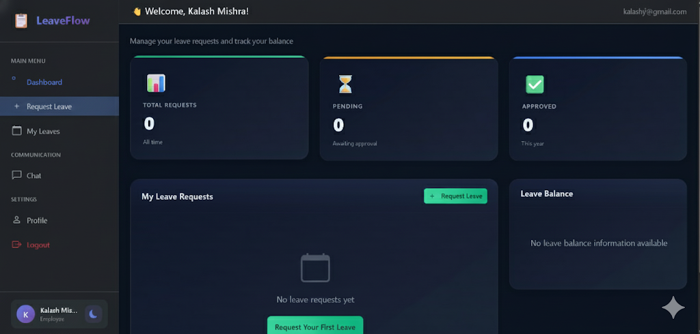

# 📋 LeaveFlow - Employee Leave Management System

A modern leave management system built with Django for efficient leave tracking, approval workflows, and real-time communication.


🔗 **Live Demo**: [https://leaveflow-4ppo.onrender.com](https://leaveflow-4ppo.onrender.com/accounts/login/)

---

## 📸 Screenshots

### Employee Dashboard


### Leave Request Form


### Manager Dashboard


### Real-time Chat


---

## ✨ Key Features

- 🔐 **Email-based Authentication** - Login with email, role-based access (Admin, Manager, Employee)
- 📝 **Leave Management** - Request, approve/reject leaves with automatic day calculation
- 💬 **Real-time Chat** - Employee-Manager messaging with file attachments
- 📊 **Dashboard Analytics** - Track leave requests, balances, and team statistics
- 🎨 **Modern UI** - Dark theme with glassmorphism design and smooth animations
- 📱 **Responsive Design** - Works on mobile, tablet, and desktop

---

## 🛠 Tech Stack

- **Backend**: Django 4.2, Python 3.11
- **Frontend**: Bootstrap 5, HTML5, CSS3, JavaScript
- **Database**: SQLite (dev), PostgreSQL (production)
- **Authentication**: django-allauth
- **Deployment**: Render


---

## 🚀 Quick Start

### 1. Clone Repository
```bash
git clone https://github.com/kalashmishra21/LeaveFlow.git
cd LeaveFlow
```

### 2. Setup Virtual Environment
```bash
# Windows
python -m venv venv
venv\Scripts\activate

# Linux/Mac
python3 -m venv venv
source venv/bin/activate
```

### 3. Install Dependencies
```bash
pip install -r requirements.txt
```

### 4. Run Migrations
```bash
python manage.py migrate
python manage.py create_leave_types
```

### 5. Create Admin User
```bash
python manage.py createsuperuser
```

### 6. Run Server
```bash
python manage.py runserver
```

Visit: **http://127.0.0.1:8000/**


---

## 👥 User Roles

| Role | Permissions |
|------|-------------|
| **Admin** | Full system access, manage all users and leaves |
| **Manager** | Approve/reject team leaves, view team history, chat with employees |
| **Employee** | Request leaves, view balance, chat with managers |

---

## 📝 License

MIT License - Free to use for learning or commercial purposes.

---

**Built with ❤️ using Django and Bootstrap**
