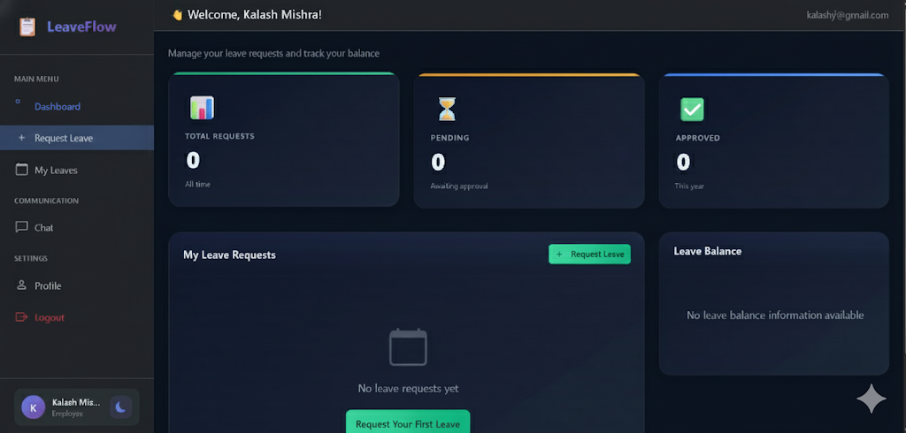

# 📋 LeaveFlow - Employee Leave Management System

A modern leave management system built with Django for efficient leave tracking, approval workflows, and real-time communication.


🔗 **Live Demo**: [https://leaveflow-4ppo.onrender.com](https://leaveflow-4ppo.onrender.com/accounts/login/)

---

## 📸 Screenshots

### Employee Dashboard


### Leave Request Form


### Manager Dashboard


### Real-time Chat


---

## ✨ Key Features

- 🔐 **Email-based Authentication** - Login with email, role-based access (Admin, Manager, Employee)
- 📝 **Leave Management** - Request, approve/reject leaves with automatic day calculation
- 💬 **Real-time Chat** - Employee-Manager messaging with file attachments
- 📊 **Dashboard Analytics** - Track leave requests, balances, and team statistics
- 🎨 **Modern UI** - Dark theme with glassmorphism design and smooth animations
- 📱 **Responsive Design** - Works on mobile, tablet, and desktop

---

## 🛠 Tech Stack

- **Backend**: Django 4.2, Python 3.11
- **Frontend**: Bootstrap 5, HTML5, CSS3, JavaScript
- **Database**: SQLite (dev), PostgreSQL (production)
- **Authentication**: django-allauth
- **Deployment**: Render


---

## 🚀 Quick Start

### 1. Clone Repository
```bash
git clone https://github.com/kalashmishra21/LeaveFlow.git
cd LeaveFlow
```

### 2. Setup Virtual Environment
```bash
# Windows
python -m venv venv
venv\Scripts\activate

# Linux/Mac
python3 -m venv venv
source venv/bin/activate
```

### 3. Install Dependencies
```bash
pip install -r requirements.txt
```

### 4. Run Migrations
```bash
python manage.py migrate
python manage.py create_leave_types
```

### 5. Create Admin User
```bash
python manage.py createsuperuser
```

### 6. Run Server
```bash
python manage.py runserver
```

Visit: **http://127.0.0.1:8000/**

## Render deployment

Use a **persistent PostgreSQL database**. Set `DATABASE_URL` to its connection URL in the Render web service environment. Without it, Render deployments now fail clearly: SQLite on Render's ephemeral filesystem loses users and sessions on restarts and spin-downs.

Set these environment variables on the web service:

| Name | Value |
| --- | --- |
| `DATABASE_URL` | PostgreSQL connection URL |
| `SECRET_KEY` | A new, long random Django secret; keep the same value across deploys |
| `DEBUG` | `False` |
| `ALLOWED_HOSTS` | `leaveflow-4ppo.onrender.com` (include any custom domain) |
| `ADMIN_EMAIL`, `ADMIN_PASSWORD` | Optional, only for initial admin creation; choose a strong password |

Build command: `bash build.sh`. Start command: `gunicorn config.wsgi:application --bind 0.0.0.0:$PORT --workers 2 --threads 2 --timeout 90`.

The build creates an admin only when both admin environment variables are set. Change or remove `ADMIN_PASSWORD` in Render after the first deploy. Existing accounts remain in PostgreSQL through restarts. Accounts previously stored in Render's SQLite filesystem cannot be restored after that instance has restarted unless you already have a backup.

The scheduled GitHub Actions workflow calls `/health/` about every five minutes. Scheduled jobs can be delayed or skipped; a paid always-on Render instance is the reliable way to avoid the free tier's cold-start loading page. Keeping a free service awake consumes its monthly free instance hours. Render's free PostgreSQL databases expire after 30 days, so use a durable database for long-term accounts. Files uploaded to `/media/` are still stored on the ephemeral filesystem; use persistent object storage before relying on profile pictures or chat attachments across deploys.


---

## 👥 User Roles

| Role | Permissions |
|------|-------------|
| **Admin** | Full system access, manage all users and leaves |
| **Manager** | Approve/reject team leaves, view team history, chat with employees |
| **Employee** | Request leaves, view balance, chat with managers |

---

## 📝 License

MIT License - Free to use for learning or commercial purposes.

---

**Built with ❤️ using Django and Bootstrap**
